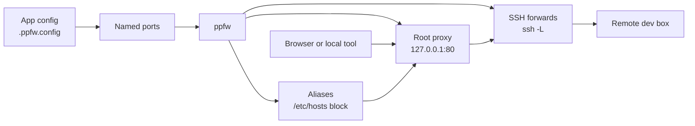
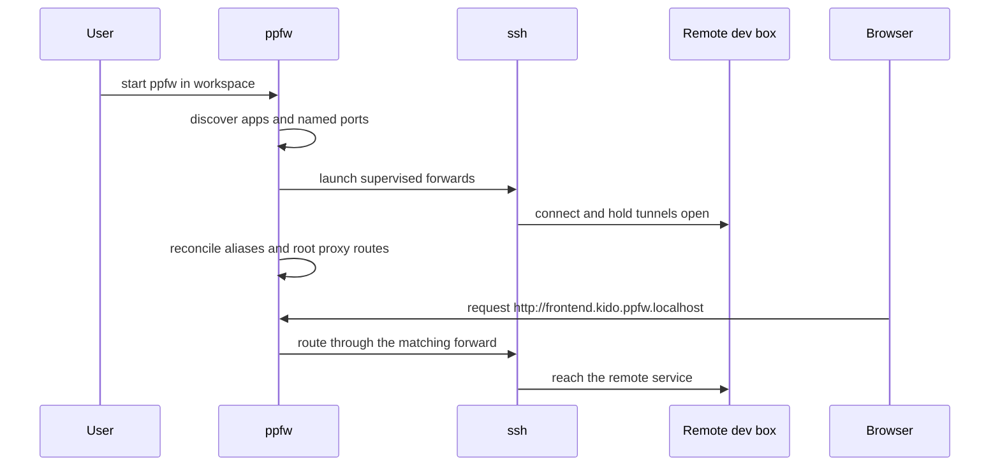

# ppfw

ppfw turns services on remote dev boxes into friendly local URLs.

Instead of remembering which SSH tunnel owns which port, you declare the ports
each app cares about and ppfw gives them stable names such as
`http://frontend.kido.ppfw.localhost` while it supervises the forwards behind
them.

It is a control surface for day-to-day remote development: discover apps, start
and stop their forwards, recover from flaky connections, and keep local aliases
pointing at the right ports without rebuilding your mental map every time.

## Why ppfw

Remote development usually falls apart in the same places:

- too many ad hoc `ssh -L` commands
- ports that collide across apps
- tunnels that silently die and need babysitting
- URLs like `localhost:5173` that do not explain which app they belong to

ppfw replaces that with a small set of domain concepts:

- an **app** declares named ports in `.ppfw.config`
- a **remote** is just an `~/.ssh/config` host alias
- a **forward** puts a remote port on localhost
- an **alias** gives that port a friendly hostname
- the **root proxy** lets those aliases work as bare hostnames in a browser

## How it works



At runtime, ppfw:

1. scans the **workspace root** for apps
2. reads each app's named ports and remote overrides
3. starts and supervises the requested SSH forwards
4. reconciles local alias entries for those apps
5. starts the privileged root proxy so aliases resolve without typed ports

A second view of the same system:



## Installation

### Current

Right now the reliable way to run ppfw is from source:

```bash
bun install
bun run start -- --workspace ~/dev
```

Requirements for the current source-based flow:

- native macOS or native glibc Linux
- Bun >= 1.3
- `ssh`
- permission to use `sudo` when ppfw starts the root proxy on `127.0.0.1:80`

WSL2 is not currently supported.

### Planned install experience

The intended end-user installation is a one-line install script backed by
prebuilt binaries for:

- macOS arm64
- macOS x64
- Linux x64
- Linux arm64

That flow is the target design, but it is not shipped in this repository yet.

## Quickstart

Create a workspace app with a `.ppfw.config`:

```yaml
name: kido
remote: devbox
ports:
  frontend: 5173
  api:
    port: 3232
```

Then run ppfw against the workspace containing that app:

```bash
bun run start -- --workspace ~/dev
```

With the default alias suffix, the app above gets:

- `frontend.kido.ppfw.localhost` -> remote port `5173`
- `api.kido.ppfw.localhost` -> remote port `3232`

The TUI is the live control surface: use it to inspect state, restart a failed
forward, rescan the workspace, and see why the root proxy or a tunnel is down.

## Configuration

### Global config

`~/.config/ppfw/config.yaml` (honors `$XDG_CONFIG_HOME`):

```yaml
workspace: ~/dev              # root scanned for .ppfw.config; defaults to cwd
default_remote: devbox        # fallback ~/.ssh/config host alias
alias_suffix: ppfw.localhost  # suffix for derived alias hostnames
```

CLI flags override the file: `--workspace`, `--remote`.

### App config

An app is any directory holding a `.ppfw.config`:

```yaml
name: kido              # optional; defaults to the directory name
remote: devbox-a        # optional; overrides default_remote
ports:
  frontend: 5173        # bare number = forward + derived alias
  api:
    port: 3232
    alias: api-v2.kido.example   # full-hostname override
  db:
    port: 5432
    alias: false        # forward only
  localui:
    port: 9000
    forward: false      # standalone alias, no forward
```

Derived aliases are `<port-name>.<app-name>.<alias_suffix>` — with the config
above, `frontend` becomes `frontend.kido.ppfw.localhost`.

## What ppfw manages while it runs

- discovery of apps under the workspace root
- start, stop, and restart of forwards per app or globally
- reconnect with backoff for transient SSH failures
- inline error reporting for permanent failures
- alias reconciliation in a marker-delimited `/etc/hosts` block
- the privileged root proxy used for bare-hostname browsing

## Development

```bash
bun test          # unit tests
bun run typecheck # tsc --noEmit
```

See [CONTEXT.md](CONTEXT.md) for the domain glossary and `docs/adr/` for the
architecture decisions.
